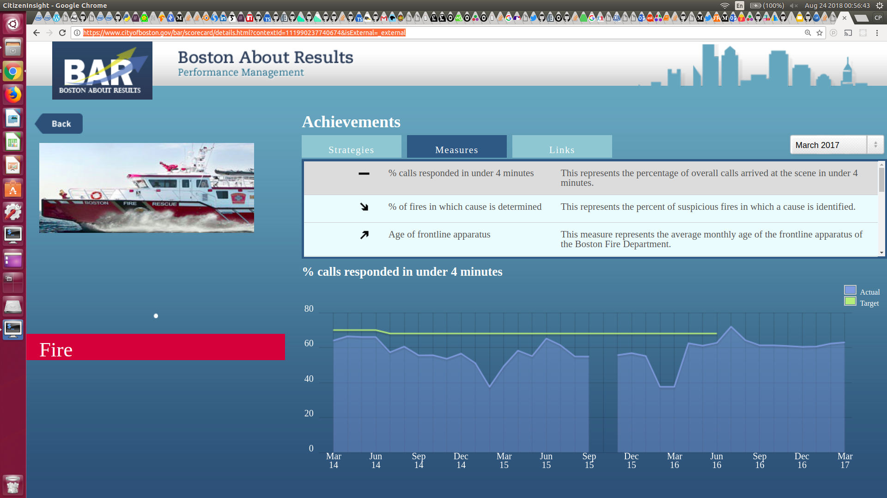
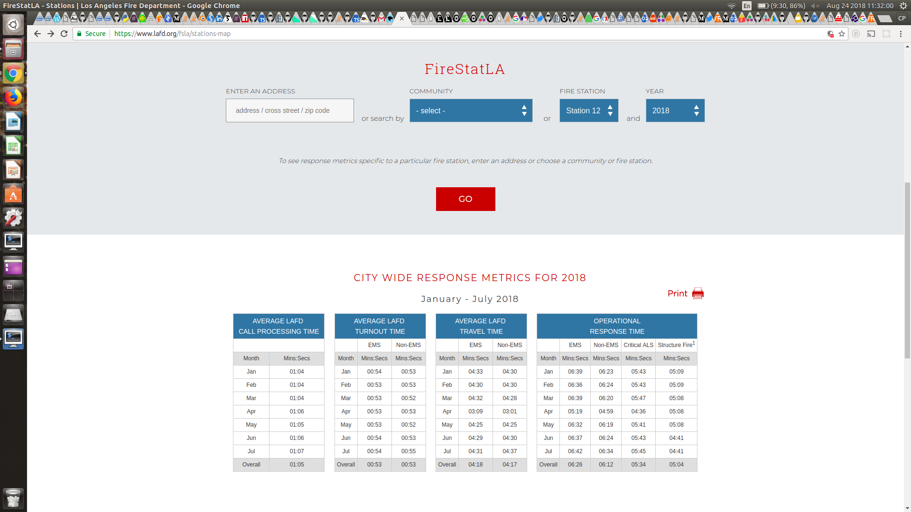
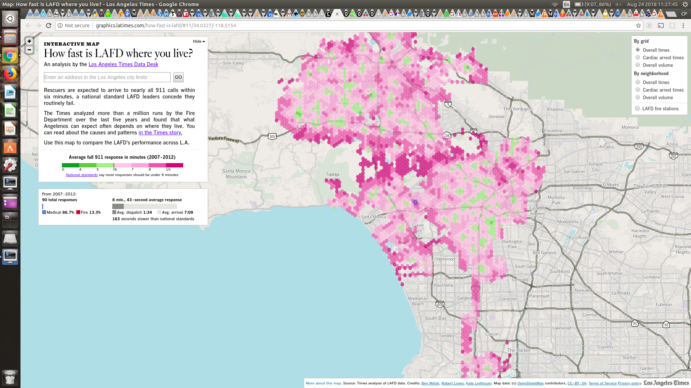
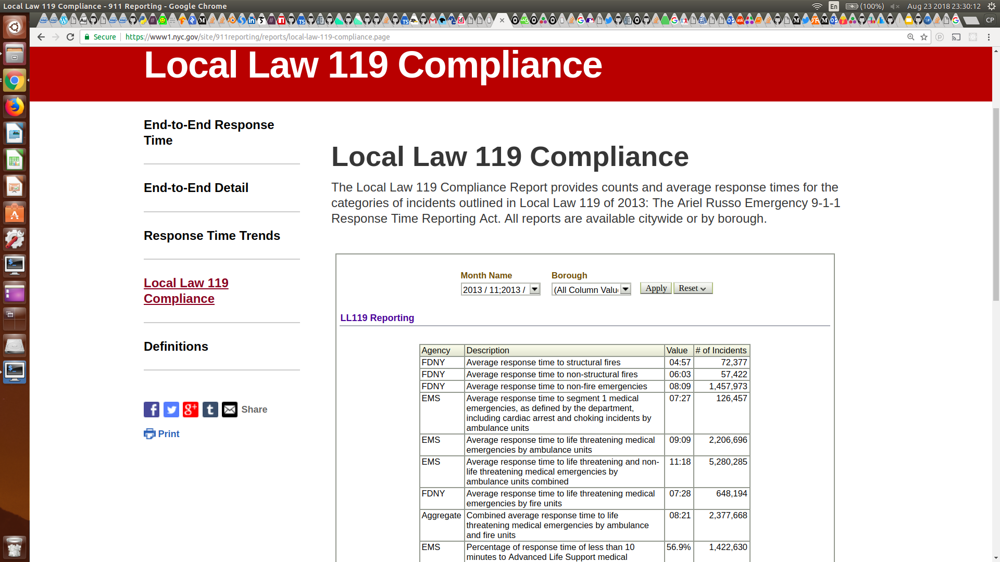
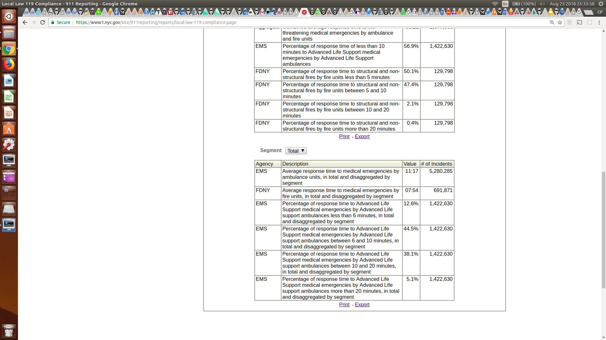

## FDNY + EMD response time visualization 

30 August 2018

<small>Christopher Prince</small>

---

### Agenda

1. <!-- .element: class="fragment fade-up" -->9-1-1 reporting outside NYC
2. <!-- .element: class="fragment fade-up" -->NYC's Local Law 119
3. <!-- .element: class="fragment fade-up" -->Technologies
4. <!-- .element: class="fragment fade-up" -->Demonstration
5. <!-- .element: class="fragment fade-up" -->Next steps and opportunities for improvement

---

### 9-1-1 reporting standards 

<!-- .element: class="fragment" -->US national standards for response times to fire and medical emergencies are regulated by NFPA Standard 1710: 
<small><a href="https://bit.ly/2P3GP6u">"Standard for the Organization and Deployment of Fire Suppression Operations, Emergency Medical Operations, and Special Operations to the Public by Career Fire Departments"</a></small>

<!-- .element: class="fragment" -->How municipalities report (_or do not report_) their performance against these standards varies.

- -

#### 9-1-1 reporting outside NYC

** Boston **

* Boston only provides extremely basic information on response times: https://bit.ly/2wn4s28

- -

#### 9-1-1 reporting outside NYC

** Chicago **

* CFD measures total response times via its CAD data, but does NOT report on it publically.
* The Chicago Office of the Inspector General has twice audited the CFD data and both times cast doubt on their responsiveness. 

<small>https://bit.ly/2BI2Q91</small>

- -

#### 9-1-1 reporting outside NYC

** Los Angeles **

* <a href="https://www.lafd.org/fsla/stations-map" data-preview-link>FireStatLA: official statistics reporting from LAFD</a>
* <a href="http://graphics.latimes.com/how-fast-is-lafd/#11/34.0498/-118.5998" data-preview-link>LA Times independent analysis</a>

---

### NYC's Local Law 119 

Also known as "The Ariel Russo Emergency 9-1-1 Response Time Reporting Act" of 2013.

<small>"'Reckless' Teen Who Killed 4-Year-Old Girl Gets Up to 9 Years in Prison," dnainfo.com, 19 Feb 2016. https://bit.ly/1Q6lVAB</small>

- -

#### NYC's Local Law 119 

Requires reporting of response times to 9-1-1 calls across nine categories, with some overlap of NFPA 1710:

**Fire**
* Average response time to structural fires 
* Average response time to non-structural fires
* Average response time to non-fire emergencies

- -

#### NYC's Local Law 119 

**EMS**
* Average EMS response time to "segment 1" medical emergencies
* ... plus other life threatening emergencies
* ... plus non-life threatening emergencies
* Percentage of response times less than 10 minutes for Advanced Life Support emergencies

- -

#### NYC's Local Law 119 

**Mixed**
* Average Fire response time to life threatening medical emergencies
* Average Fire + EMS response time to life threatening medical emergencies

- -

#### NYC's Local Law 119 

<small>https://www1.nyc.gov/site/911reporting/reports/local-law-119-compliance.page</small>

- -

#### What questions go unanswered?

Many, but two immediate questions that I have are:

* What is the distribution of response times (not just averages)?
* How do response times vary across the city?

** &rArr; the public has the data and the tools to answer these questions! **

---

### Technologies

- -

#### Implementation

* <!-- .element: class="fragment" data-fragment-index="0"-->All of these technologies are Open Source and cost free.
* <!-- .element: class="fragment" data-fragment-index="1"-->JavaScript + React implementation works in nearly all recent browsers\* and does not require any additional software for users to install.
* <!-- .element: class="fragment" data-fragment-index="2"-->Notebook format permits intuitive auditing of methods and algorithms.

<!-- .element: class="fragment" data-fragment-index="1"--> <small>\* i.e., not IE</small>

- -

#### Open Data

* <!-- .element: class="fragment" --> FDNY provides two data sets, covering incidents from 1 Jan 2013 onwards:
    * [EMS Data](https://data.cityofnewyork.us/Public-Safety/EMS-Incident-Dispatch-Data/76xm-jjuj), with 7.02 million rows
    * [Fire Data](https://data.cityofnewyork.us/Public-Safety/Fire-Incident-Dispatch-Data/8m42-w767i), with 2.75 million rows
* <!-- .element: class="fragment" --> The EMS data itself is **_1.7 GB!_** 
    * This is far too much data to transfer to every user; this is almost "big data".
    * Don't bring data to the computer, bring computation to the data. <small>(or use the computation resources already at the data)</small>

---

## <a href="https://beta.observablehq.com/d/db264f30fb264c08" data-preview-link>Live demonstration</a>

---

### Next steps and opportunities to improve

* Verify data against existing reporting
* Add combined Fire and EMS medical emergency reporting
* Add Advanced Life Support statistics
* Add time series for trend analysis

---

## Thank you!

This presentation can be found at https://cmprince.github.io/NYC-911-Viz/.

The demo is not yet public, but can be accessed at <a href="https://beta.observablehq.com/d/db264f30fb264c08">this private link</a>.

- -

# Q & A

